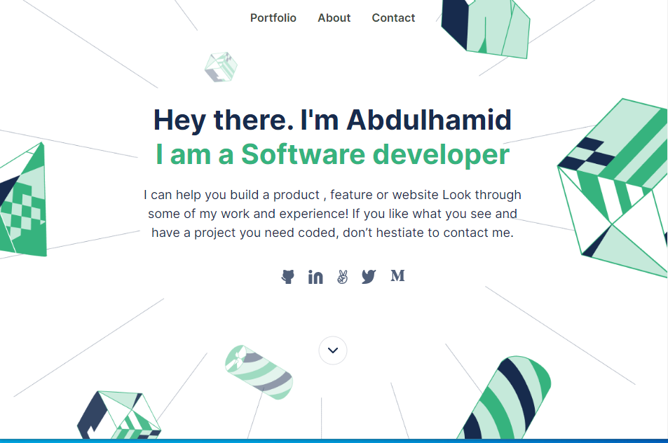
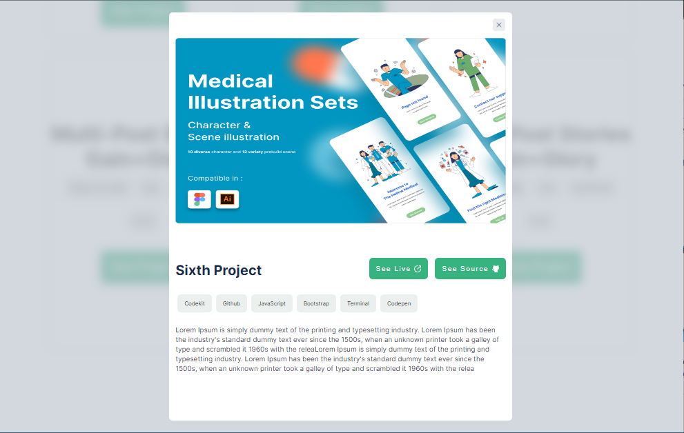
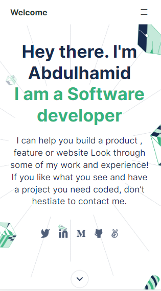
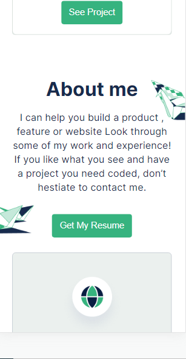
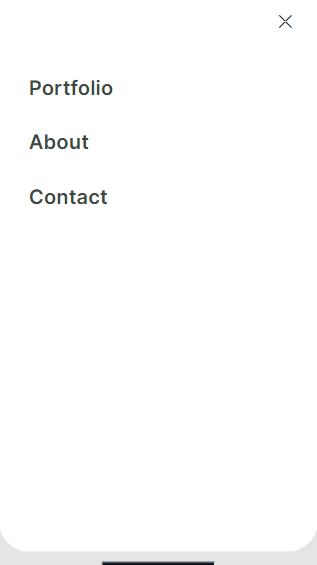

# Portfolio Design

> This project is a Responsive version of my portfolio design, the website looks good (and readable) on all screens.


## Built With

- HTML & CSS

## Live Demo

🔥 [Click here](https://abdulhamid-adio-portfolio.netlify.app/) 🔥

## Screenshots






## Getting Started

To get a local copy up and running follow these simple example steps.

### Clone this repository

```
git clone https://github.com/abdulhamiid/portfolio.git
```

Open project derectory
```
cd portfolio
```

## Getting Started

### Deployment

open the ```index.html``` on your Browser


## Author

👤 **Abdulhamid**

- GitHub: [abdulhamiid](https://github.com/abdulhamiid)
- Twitter: [@abdulhamid_adio](https://twitter.com/abdulhamid_adio)
- LinkedIn: [LinkedIn](https://linkedin.com/)

## 🤝 Contributing

Contributions, issues, and feature requests are welcome!

Feel free to check the [issues page](https://github.com/abdulhamiid/portfolio/issues).

## Show your support


Give a ⭐️ if you like this project!

## Acknowledgments

- Thanks to microverse

## 📝 License

This project is [MIT](./LICENSE) licensed.
